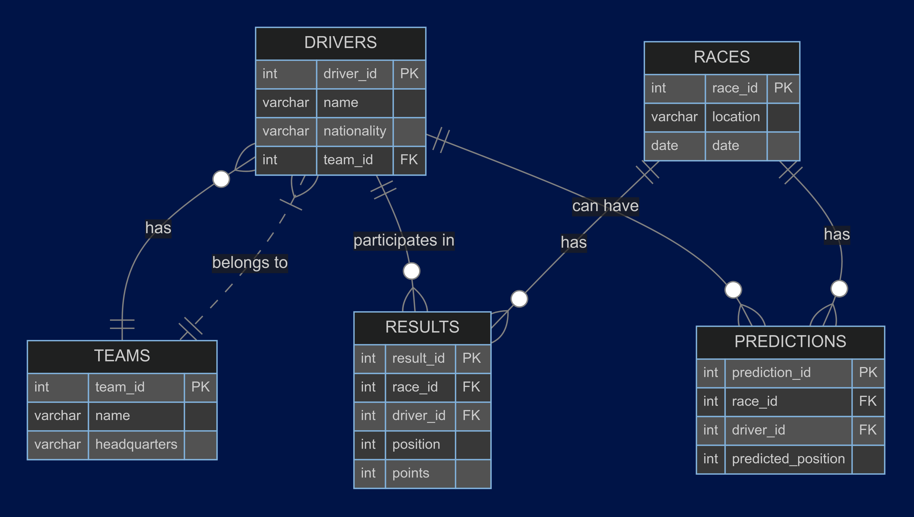

# F1 Results and Predictions Database

# Design Document

By Mitra Boga

Video overview: <https://youtu.be/9YZ3KIhXIEE>

## Scope

This database stores information about Formula 1 races, results, and predictions. It enables analysis of race outcomes and prediction accuracy. The database includes entities for drivers, teams, races, results,  predictions. It supports queries for race results, driver standings, and prediction accuracy.

## Functional Requirements
### What should a user be able to do with your database?
* **View Race Results**: Users should be able to query and view the results of past races, including positions and points scored by each driver.
* **View Driver Standings**: Users should be able to query and view the cumulative points and standings of all drivers across multiple races.
* **View Predictions**: Users should be able to query and view predictions for upcoming races.
* **Compare Predictions with Actual Results**: Users should be able to compare predictions with actual race results to evaluate prediction accuracy.
* **Add New Data**: Users should be able to insert new data for drivers, teams, races, results, and predictions.

### What's beyond the scope of what a user should be able to do with your database?
* **User Authentication**: The database does not handle user authentication or access control; it assumes all users have the same level of access.
* **Real-Time Updates**: The database is not designed for real-time updates or live race tracking.
* **Driver Transfers**: The database does not handle complex scenarios such as driver transfers between teams during a season.
* **Detailed Race Analytics**: Advanced analytics beyond basic queries (e.g., lap times, pit stop strategies) are not within the scope of this database.
* **Graphical Interface**: The database does not provide a graphical user interface; it is intended to be queried using SQL.

## Representation

Entities are captured in SQLite tables with the following schema.

### Entities

* **Drivers**: Represents each driver, linked to a team.
* **Teams**: Represents each team.
* **Races**: Represents each race.
* **Results**: Represents race results, linked to drivers and races.
* **Predictions**: Represents predictions for future races, linked to drivers and races.

The data types were chosen to match the nature of the data and ensure efficiency:
* `INT`: Used for primary keys and foreign keys because these fields store whole numbers and are frequently used for indexing and joins.
* `VARCHAR`: Used for text fields like names and locations to allow for variable-length strings, which are common for such attributes.
* `DATE`: Used for race dates to leverage SQL's date functions and ensure proper date formatting and operations.
* `INT`: Used for numeric fields like positions and points to enable arithmetic operations and comparisons.

Constraints were chosen to ensure data integrity and maintain the relational structure of the database:
* **Primary Keys**: Ensure each record in a table is uniquely identifiable.
* **Foreign Keys**: Maintain referential integrity between tables, ensuring that related records exist in their respective tables.
* **NOT NULL**: Ensure essential fields are always populated, preventing incomplete data entries.
* **Unique Constraints**: Prevent duplicate records where necessary (e.g., a unique combination of race and driver in the results table).

### Relationships

## Optimizations

Indexes on foreign keys (e.g., `driver_id`, `race_id`) to speed up join operations.

## Limitations

This database assumes a static list of drivers and teams. It doesn't handle changes like driver transfers between teams.
